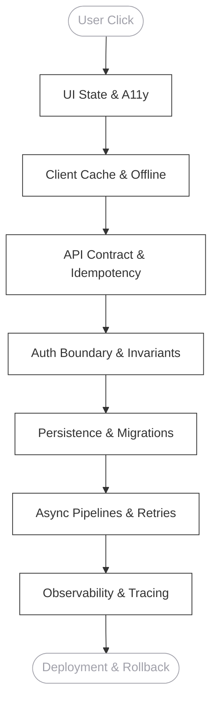

# ⬡ THE ARCHITECT

 

 

*I design for change, failure, and humans.*

 
 

 

### 01. THE TRACE

Most teams split the stack and call it specialization. I refuse the split as an excuse for shallow thinking. If I cannot walk this path for my own features, I am assembling, not architecting.

 

### 02. AXIOMS

> **Shape before code.** Structure emerges from constraints (traffic patterns, team boundaries, failure tolerance). Code fills the shape. Starting with frameworks makes systems expensive to change.

> **Interfaces are promises.** REST endpoints, GraphQL schemas, React props, database foreign keys — each is a contract. Breaking changes are incidents waiting for a calendar date.

> **Simplicity is load-bearing.** Predictable behavior without archaeology. If the system requires a diagram to explain a single feature, the design has already failed.

> **Operational reality is design.** A feature that cannot be monitored, rolled back, or debugged at 2 AM is incomplete.

 

### 03. LAYER FLUENCY

  

 

| Layer | Focus |
| :--- | :--- |
| **Frontend** | State models · render strategy · performance budgets · accessible error UX |
| **Backend** | Domain boundaries · idempotency · layered auth · sync & event-driven flows |
| **Data** | Schema-as-API · index design · consistency models · cache invalidation |
| **Platform** | IaC · containers · env parity · graceful degradation under slow deps |
| **Reliability**| Traces · SLOs · error budgets · load & chaos as design reviews |
| **Security** | Threat modeling · least privilege · supply chain · privacy by design |

 

### 04. PATTERNS & ANTI-PATTERNS

<b>View Architectural Stance</b>

 

#### Patterns I reach for
- **Modular monolith** — Default starting point until team scale forces a split.
- **Strangler fig** — Legacy migration without big-bang rewrites.
- **Outbox pattern** — Reliable side effects without dual-write bugs.
- **Circuit breaker** — Failure containment under dependency stress.
- **Feature flags** — Decoupling deployment from release.

#### What I reject
- **Resume-driven development** — Choosing tech because the market values it, not because throughput requires it.
- **Distributed monolith** — Microservices sharing a database and a deployment train.
- **Architecture astronautics** — Diagrams that never survived contact with an incident.
- **Premature abstraction** — Frameworks inside frameworks before the second use case exists.

#### Definition of Done
A feature is not done when it merges. It ships when:
1. Success, failure, and edge cases are specified.
2. Data migrations are backward compatible.
3. Auth is enforced server-side.
4. Metrics and logs exist to answer *why* in production.
5. Rollback path is verified.

 
 

  

 

  

